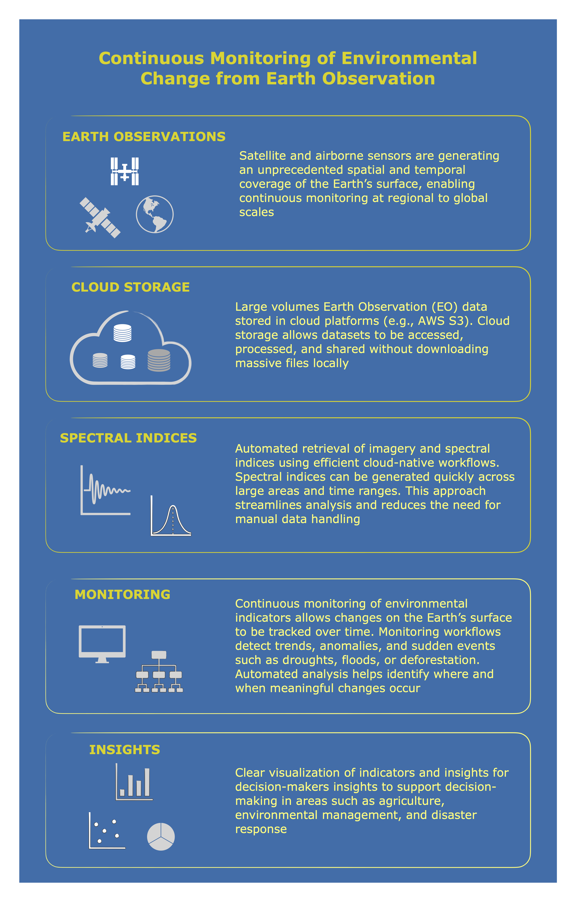

# geospatial_mlops
An end-to-end MLOps pipeline for geospatial data analysis and modeling

This repository contains the implementation of an automated MLOps pipeline designed for geospatial data analysis. The project focuses on leveraging open-source satellite data to monitor environmental indicators and predict changes over time.

For a detailed description of the project, including its objectives, pipeline design, and technical stack, please refer to the [Project Overview](docs/project_overview.md).

